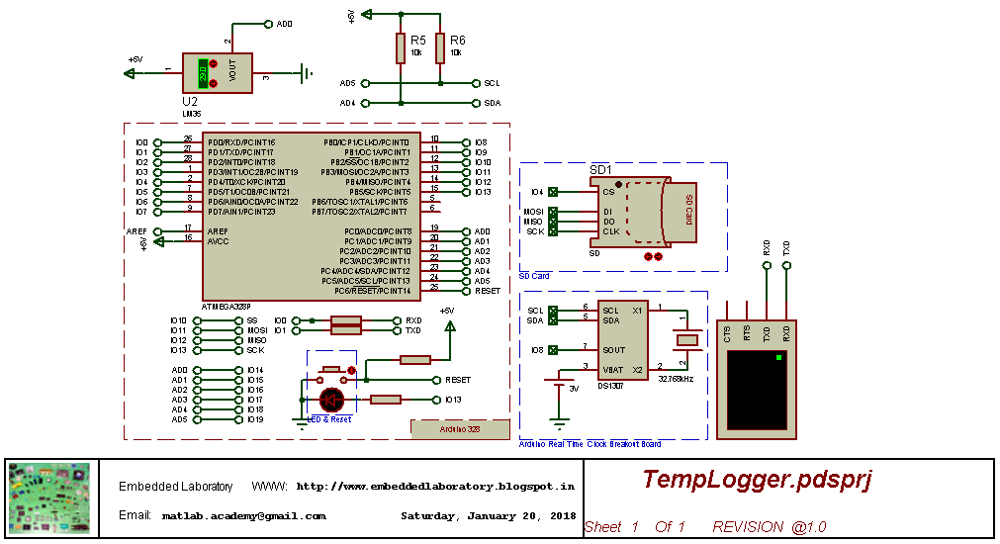

# ArduinoTempLogger
In Arduino Based Temperature Logger project, with the help of Arduino board, temperature is sensed using the ADC channel and then the ADC data is converted into temperature values and is stored in memory card along with time at which this temperature is measured.
Later this stored data is used to generate graphs of the temperature.

### Schematic Diagram

Tools Used for Analyse this data are:
- Excel
- Python
  
- MATLAB
- LabVIEW
